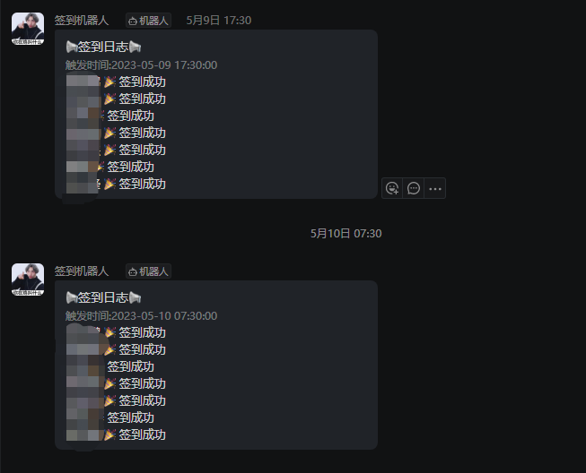

# 校友邦实习自动签到

------

## 食用方式

1. 添加账号

   - 小程序方式(通过抓包抓取openId和unionId)

   - 密码方式(推荐)

     具体参考config.yaml中的注释进行填写
   
3. 服务推送以及定时规则

   参考config.yaml中的注释进行填写，目前只支持钉钉推送，当然也可以自己编写代码实现支持其他推送。
   
2. 部署服务

   要求部署环境需要docker、docker-compose环境

   在docker-compose.yaml 中执行 docker-compose up -d 即全自动编译以及部署

## 推送效果

## 免责声明

本代码仅用于学习,请在下载后的24小时删除，所造成的损失等概与本人无关，使用编译本原始码即取代同意上述。
